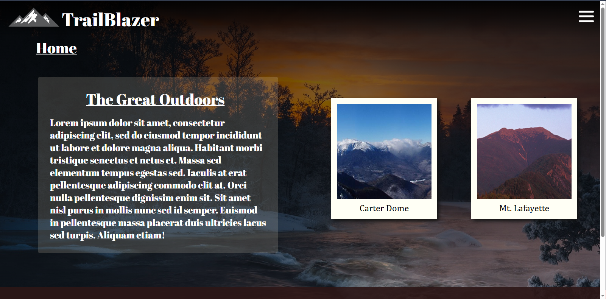
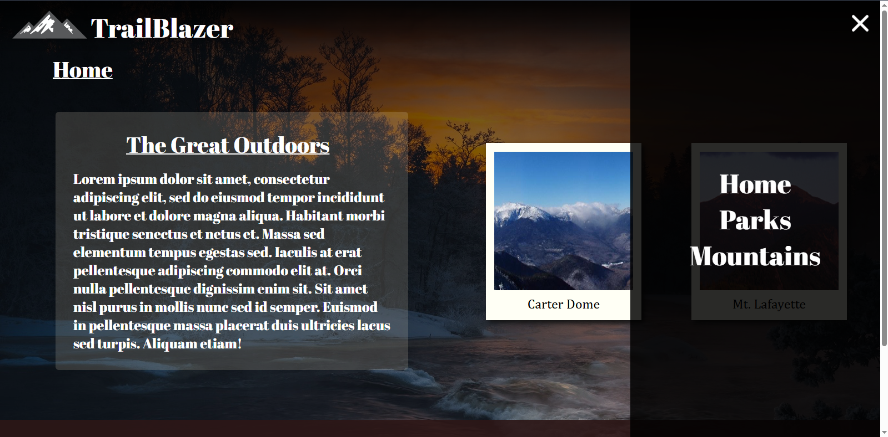
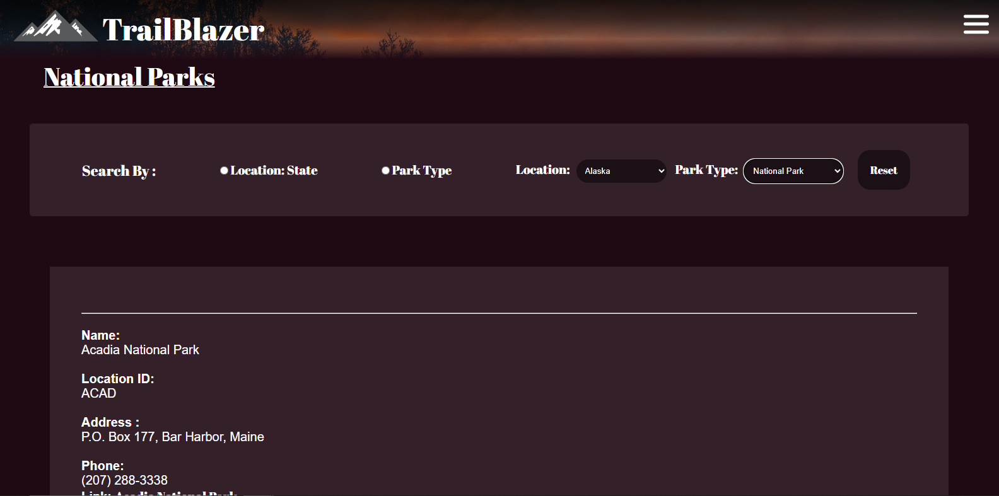
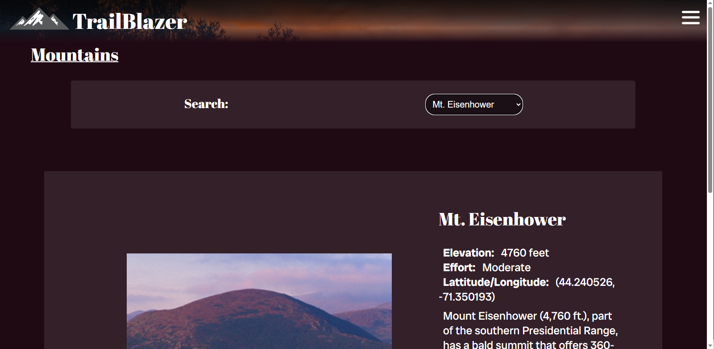
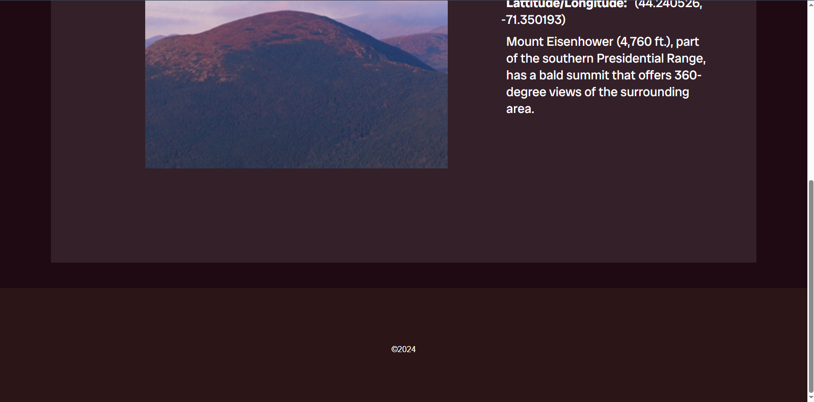

# Capstone2
This website is a guide to exploring the outdoors. It is for helping adventures find and learn about the best trails and mountains located in the USA.
## Home Page
The home page includes a brief summary of the website (filled with lorem ipsum) and polaroids of mountains. 

The navagation slides over presenting you with the rest of the links for the website.

## Parks Page
The park page allows you to filter which parks you want more information for by state and park type.

## Mountains Page
The mountain page includes a drop down and lets you pick which mountain you want to see and then gives information about it and a picture of what it looks like.

